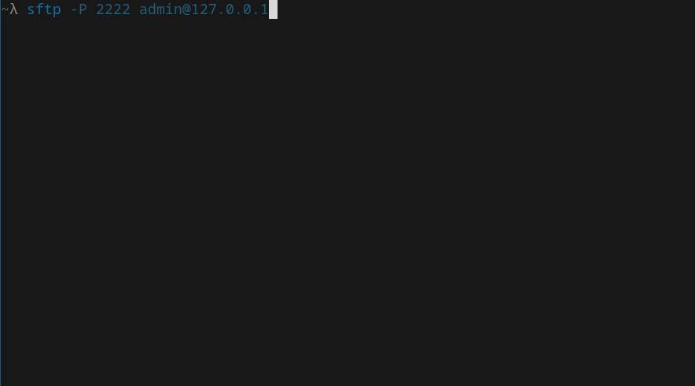

# opencloud-sftp
A [OpenCloud](https://github.com/opencloud-eu/) service which enables users to access their files securely over SFTP.


> ⚠️ WARNING: This is currently in a proof of concept stage. Don't use it in production!

--

## User Flow
Log-In to OpenCloud using the Web UI and create a folder named ".ssh" in your home directory. Upload one or more of your public SSH keys to this folder. The names of the key files should end with ".pub". 


> ℹ️ The ".ssh" folder is hidden by default, so you may need to enable "show hidden files" in the web view.

> ℹ️ Storing keys in the ".ssh" folder is a temporary solution. In future versions it shall be possible to add keys via user settings.

---

### Connecting
You should now be able to connect via SFTP using your OpenCloud username


## Setup

### Prerequisites
OpenCloud 2.3.0 with all services running on the same machine (simple setup, scale-out not considered yet) 

### Build opencloud-sftp
```shell
git clone https://github.com/IljaN/opencloud-sftp.git && cd opencloud-sftp
make opencloud-sftp 
cp opencloud-sftp /usr/local/bin/opencloud-sftp # Optional.
```
### Generate Configuration
```shell
$ opencloud-sftp init --sftp-addr 127.0.1:2222 
Genrating config /home/ilja/.opencloud/config/sftp.yaml
Creating service data directory: /home/ilja/.opencloud/sftp
Generating SSH Host-Key pair in /home/ilja/.opencloud/sftp
.../home/ilja/.opencloud/sftp/id_rsa
.../home/ilja/.opencloud/sftp/id_rsa.pub
```
Alternatively you can manually copy the `configs/sftp.yaml` file in to your opencloud config directory and edit it to your needs. The servers host keys 
can be generated using ssh-keygen:
```shell
mkdir -p ~/.opencloud/sftp
ssh-keygen -b 4096 -N "" -t rsa -f ~/.opencloud/sftp/id_rsa
```
## Starting the Service
```shell
# Assuming that OpenCloud is already running on localhost (opencloud server).
opencloud-sftp server
```
## Architecture
OpenCloud`s [auth-machine](https://github.com/opencloud-eu/opencloud/tree/main/services/auth-machine) service is used to impersonate the connecting SFTP user by username. The user is then granted access based
on the public SSH keys stored in the ".ssh" folder in the user's home directory. The server is implemented using [pkg/sftp](https://pkg.go.dev/github.com/pkg/sftp) for
the [VFS laver](pkg/vfs) and [gliderlabs/ssh](https://github.com/gliderlabs/ssh) for the session layer. 

## End-to-End Test Suite
The E2E test suite is fully containerized (docker) and can be executed using a single command.
```shell
make test-e2e-docker
```
For ease of use, opencloud-sftp, opencloud and the test suite are all built and run in a single container. 

## Missing Features / TODO
- [ ] Large file upload is currently not working. Use TUS for backend to backend transfers
- [ ] Settings Page extension to manage SSH keys
- [ ] Proper process handling (Ctrl-C etc.)
- [ ] Register as real opencloud service (micro)
- [ ] Cleaner configuration handling
- [ ] SFTP Read-Only mode
- [ ] Access trash-bin via SFTP
- [ ] Scale-out support
- [ ] Telemetry
- [ ] Health checks
